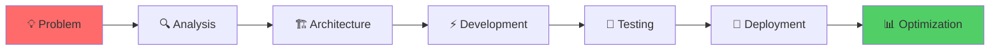

<div align="center">

# 👨‍💻 Jorge Pérez Ludeña

### Full Stack Developer · **Vigliom**

[](https://goo.gl/maps/alicante)
[](#)

*Building digital solutions from concept to deployment*

---

</div>

## 🎯 About Me

Full Stack Developer with a **backend soul** and a passion for creating complete, efficient systems. I thrive on turning complex problems into elegant solutions, from architecting robust APIs to crafting intuitive user interfaces.

```javascript
const vigliom = {
  code: ["PHP", "JavaScript", "C#", "Python", "Java"],
  focus: ["Clean Architecture", "API Integration", "Process Automation"],
  mindset: "If it can be optimized, it should be optimized",
  superpower: "Coordinating teams and tasks to deliver maintainable code"
};
```

💡 **What drives me:** Creating systems that don't just work—they **solve real problems** and make life easier.

---

## 🛠️ Tech Arsenal

<table>
<tr>
<td valign="top" width="50%">

### 🎨 Frontend Universe


### ⚙️ Backend Powerhouse


</td>
<td valign="top" width="50%">

### 🗄️ Data & Storage


### ☁️ DevOps & Cloud


</td>
</tr>
</table>

---

## 🎪 What I Do Best



- **🔌 API Integrations:** RESTful services, WebSockets, third-party integrations
- **🏛️ System Architecture:** Modular design, microservices, scalable solutions
- **🎯 Team Coordination:** Task organization, clear communication, delivery focus
- **⚙️ Automation:** Process optimization, CI/CD pipelines, workflow efficiency

---

## 🌱 Current Focus

<table>
<tr>
<td>

**🔭 Working On**
- Internal management systems
- API-driven applications
- Hardware-software integrations

</td>
<td>

**📚 Learning**
- Microservices architecture
- Advanced Laravel optimization
- .NET performance tuning

</td>
<td>

**⚡ Interests**
- IoT integrations
- Real-time systems
- Interactive kiosks

</td>
</tr>
</table>

---

## 💼 Professional Philosophy

> **"The best code is the one that makes everything look simple."**

I believe in:
- ✅ Writing code that others can understand and maintain
- ✅ Building solutions that scale with business needs
- ✅ Continuous learning and adaptation
- ✅ Balancing technical excellence with practical delivery

---

## 🚧 Projects Showcase

<div align="center">

### 🏗️ *Under Construction*

*Currently documenting and structuring projects for public release.*  
*Stay tuned for exciting updates!*

</div>

---

## 📬 Let's Connect

<div align="center">

[](https://www.linkedin.com/in/jorpelu/)
[](https://github.com/vigliom)
[](mailto:jorgeperez96jpl@gmail.com)

</div>

---

<div align="center">

### 💭 *"Code connects logic with life. That's where the magic happens."*


</div>
